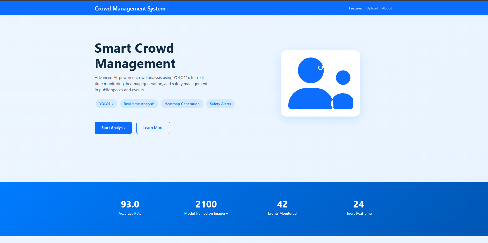
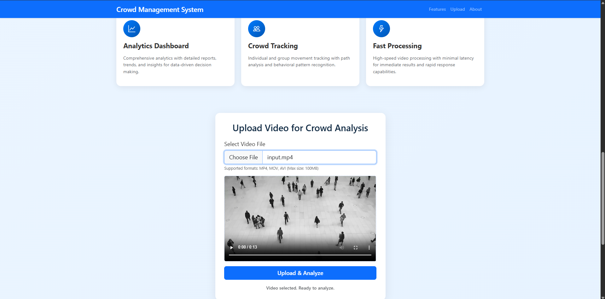
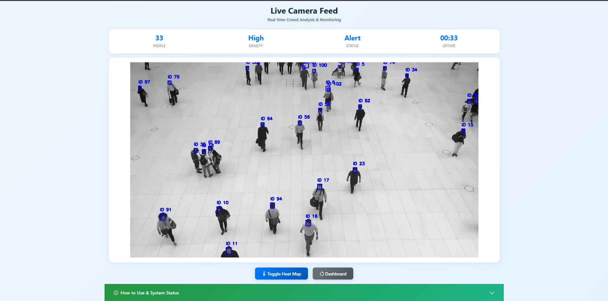
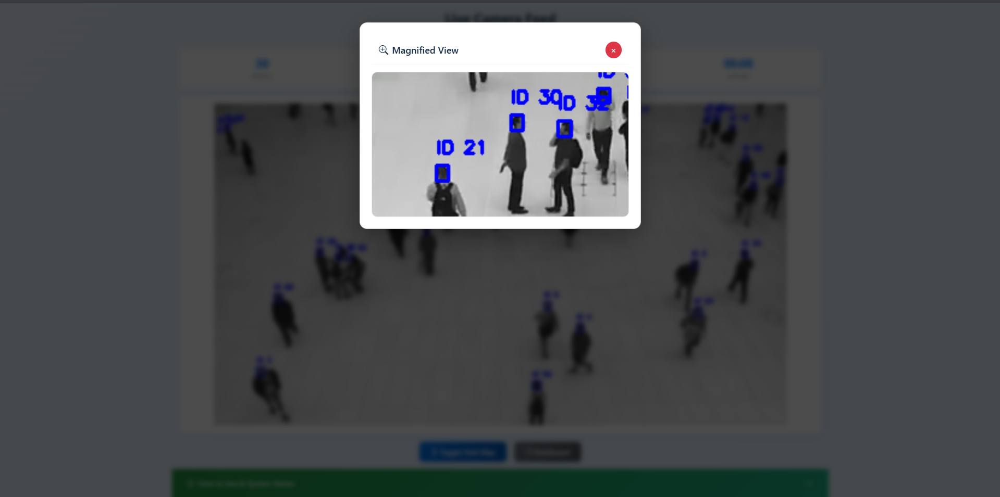
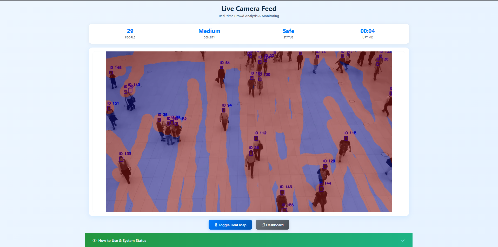

# Crowd Management System (CMS)

Efficient Crowd Management for Events & Public Spaces  
*Real-time AI Surveillance, Safety Alerts, Data Analytics, Emergency Response, and Crowd Control with Heatmap Visualization and Tracking (YOLO11x)*

---
> **Note:**  
> We have **finetuned YOLO11x** for enhanced and precise tracking performance. The model was trained on a custom dataset of over **2000 images**, using a **batch size of 4**, **image size 1024**, and trained for **100 epochs** to optimize detection accuracy for crowd scenarios.

## Overview

CMS is an advanced crowd management platform designed to enhance safety, efficiency, and decision-making in events and public spaces. Leveraging the power of **YOLO11x** for real-time object detection and tracking, CMS provides live crowd analytics, heatmap visualizations, and automated alerts, enabling proactive crowd control and emergency response.

---

## Features

- **AI Surveillance:**  
  Real-time detection and tracking of individuals using YOLO11x to monitor crowd congestion and movement patterns.

- **Video Upload & Analysis:**  
  Upload your own videos for automated crowd analysis and visualization.

- **Heatmap Visualization:**  
  Dynamic heatmaps overlay movement and density patterns, revealing high-traffic zones and potential congestion areas.

- **Safety Alerts:**  
  Automatic notifications in case of overcrowding or unusual crowd behavior.

- **Data Analytics:**  
  Monitor crowd behavior, movement trends, and generate actionable insights for event planning and safety compliance.

- **Emergency Response:**  
  Quick detection of critical situations for rapid intervention and prevention of stampedes or accidents.

- **Crowd Control:**  
  Tools and visualizations to assist in managing crowd flow and distribution.

---

## Screenshots

 
 
*Main dashboard with video upload and feature highlights*

  
*Live camera feed with person detection and tracking*

  
*Magnified grid cell for enhanced inspection*

  
*Heatmap overlay visualizing crowd density*

## Processed Video

  
*Preview of the processed video with crowd detection and heatmap overlay*

[▶️ Watch Processed Video](./static/processed/processed_input.mp4)

---

## Technologies Used

- **YOLO11x** (Ultralytics) for object detection and tracking  
- **OpenCV** for video processing and visualization  
- **Python** (backend processing)  
- **Frontend:** HTML, CSS, JavaScript (likely with a framework like Flask or FastAPI for the backend `app.py`)  
- **Heatmap Module:** Ultralytics solutions for real-time heatmap generation  
- **uv** / **pip** for environment and package management
- **Uvicorn** / Python's built-in server for running the application

---

## Getting Started & Installation

1.  **Clone the repository:**
    ```
    git clone https://github.com/vik05h/crowd-management-system.git
    cd crowd-management-system
    ```

2.  **Choose your installation method:**

    **Option 1: Using `uv`**

    1.1. Initialize `uv` environment (Python 3.10 recommended):
    ```
    uv init --python 3.10
    ```
    *(This will create a virtual environment. Activate it if not automatically activated. On Windows: `.venv\Scripts\activate`, on macOS/Linux: `source .venv/bin/activate`)*

    1.2. Install dependencies from `requirements.txt`:
    ```
    uv add -r .\requirements.txt
    ```
    *(Ensure your virtual environment is activated before running this command.)*

    1.3. **For running on CUDA (Optional):**  
    If you have an NVIDIA GPU and want to leverage CUDA for faster processing, first uninstall the CPU-only PyTorch versions and then install the CUDA-enabled versions.
    ```
    uv pip uninstall torch torchvision torchaudio
    uv pip install torch torchvision torchaudio --index-url https://download.pytorch.org/whl/cu121
    ```
    *(Adjust `cu121` to your specific CUDA version if needed. Check PyTorch official website for correct wheels.)*

    1.4. **To Run the Server (using Uvicorn, common for FastAPI/Starlette apps):**
    ```
    uvicorn app:app --reload
    ```
    *(Replace `app:app` with `your_main_file_name:your_fastapi_app_instance_name` if different. The `--reload` flag is for development and automatically reloads the server on code changes.)*

    **Option 2: Using `pip`**

    2.1. Create and activate a virtual environment:
    *   On Windows:
        ```
        python -m venv .venv
        .\.venv\Scripts\activate
        ```
    *   On macOS/Linux:
        ```
        python3 -m venv .venv
        source .venv/bin/activate
        ```

    2.2. Install dependencies from `requirements.txt`:
    ```
    pip install -r .\requirements.txt
    ```
    *(Ensure your virtual environment is activated.)*

    2.3. **For running on CUDA (Optional):**  
    If you have an NVIDIA GPU and want to leverage CUDA:
    ```
    pip uninstall torch torchvision torchaudio
    pip install torch torchvision torchaudio --index-url https://download.pytorch.org/whl/cu121
    ```
    *(Adjust `cu121` as needed.)*

    2.4. **To Run the Server (e.g., for Flask or basic Python scripts):**
    ```
    python app.py
    ```
    *(If `app.py` is your main application file. For Flask, this typically starts a development server.)*

3.  **Access the dashboard:**  
    Open your browser and go to `http://localhost:8000` (for Uvicorn default) or `http://localhost:5000` (common Flask default), or the port specified by your application.

---

## Usage

-   Upload your video file or configure a live camera feed (if supported by your `app.py`).
-   View real-time person detection, tracking, and dynamic heatmap overlays.
-   Monitor analytics and configure alerts for enhanced crowd safety.

---

## Example Code Snippet (Illustrative for Heatmap Logic)


