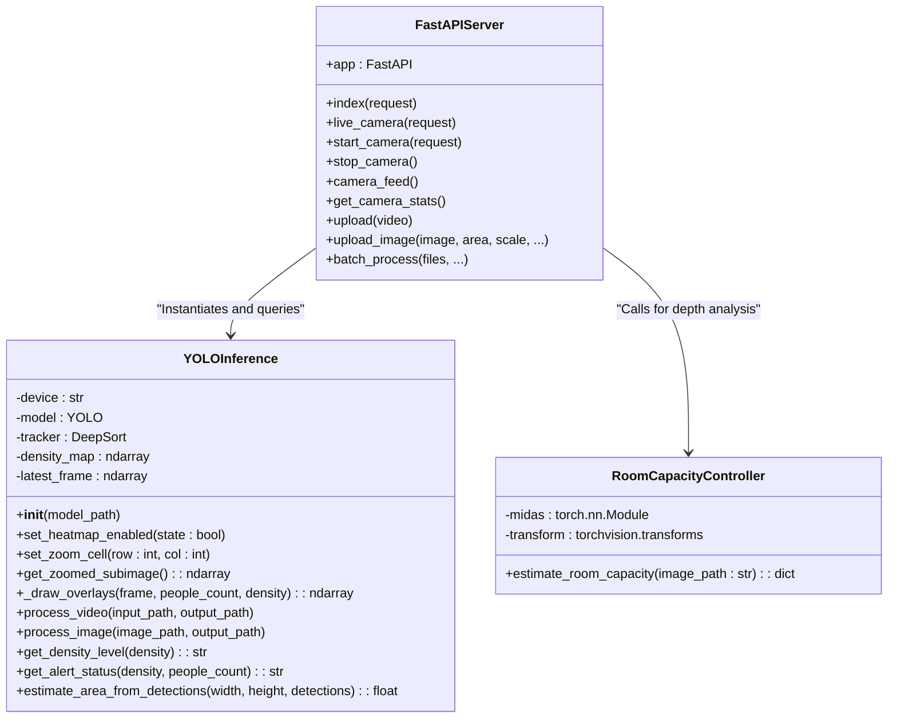
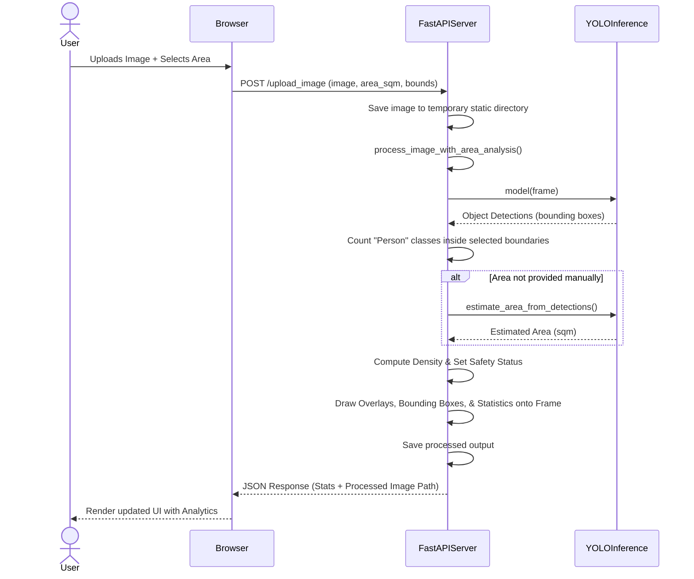
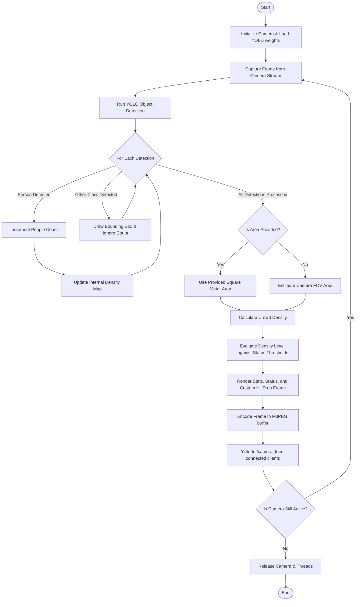
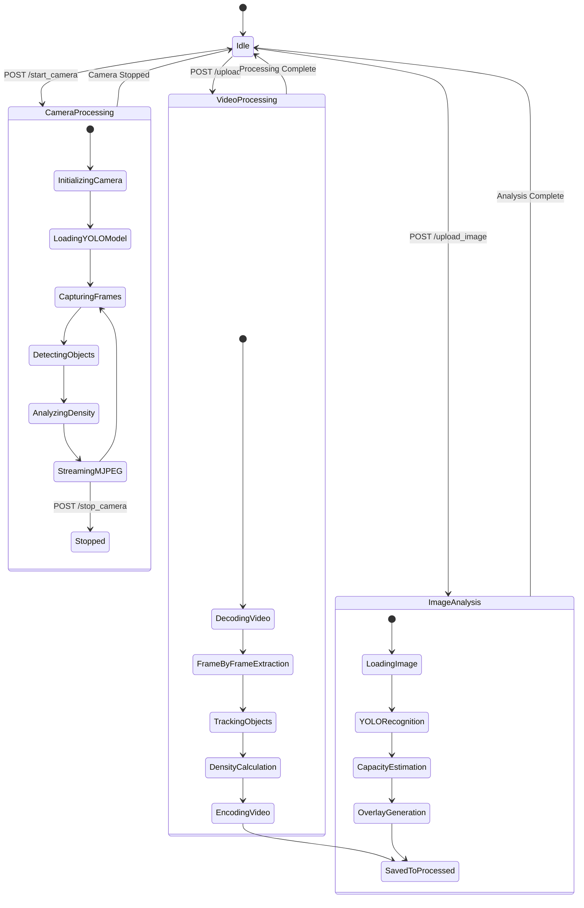
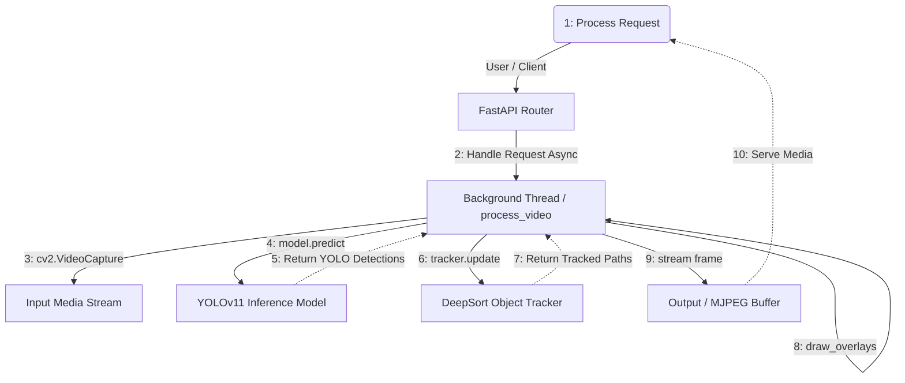

# Crowd Management System Diagrams

This document contains the core architectural and operational diagrams for the CMS project, generated based on the system's codebase (`app.py`, `yolo_inference.py`, `room_capacity.py`).

## 1. Class Diagram

The class diagram outlines the main components of the backend. It models the `FastAPI` application endpoints, the `YOLOInference` processing engine, and the MiDaS-based `RoomCapacityController`.

## 2. Sequence Diagram

This sequence diagram depicts the flow of a client uploading an image for crowd density and safety analysis over a specific area.

## 3. Activity Diagram

The activity diagram models the core repetitive flow of the **live camera feed processing thread**, handling real-time frame evaluation and stream broadcasting.

## 4. State Chart Diagram

The state chart diagram illustrates the state transitions for the primary processing pipelines: camera stream, batched video processing, and static image analysis.

## 5. Collaboration (Communication) Diagram

This diagram maps out the interactive message flow passed between objects/components during asynchronous video and camera analysis using a UML-style flowchart.

